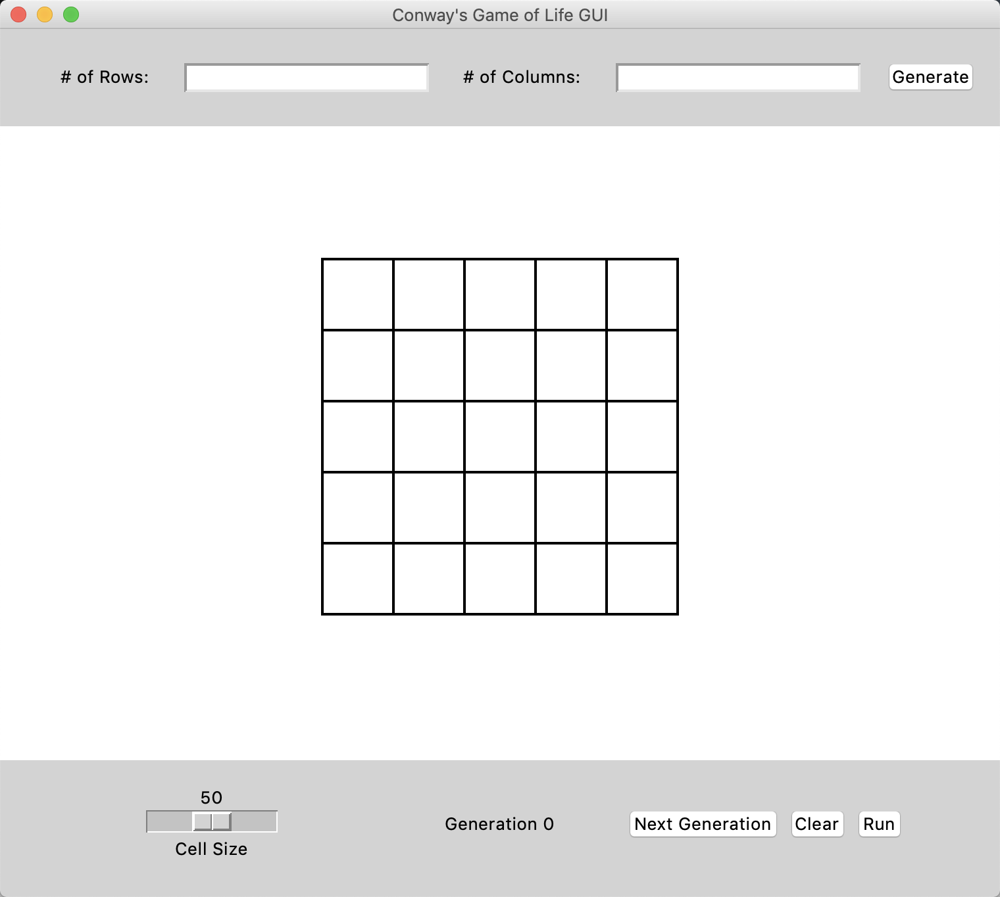

# game-of-life
A Python GUI built with tkinter which recreates Conway's Game of Life.

</img>


## Installation
Use the package manager to install dependencies.

```bash
pip install -r requirements.txt
```

## Deployment
Use the following command to deploy the GUI.
```bash
python3 LifeGUI.py 
```

## Built With
* [tkinter](https://docs.python.org/3/library/tkinter.html) – Python's standard GUI (Graphical User Interface) package
* [Pillow](https://pillow.readthedocs.io/en/stable/) – Python Imaging Library


## Roadmap
* Add tk.Scale Object to increase and decrease running speed
* Update dynamic resizing of GUI components
* Fix laggy interactions with grid


## License
[MIT](https://choosealicense.com/licenses/mit/)